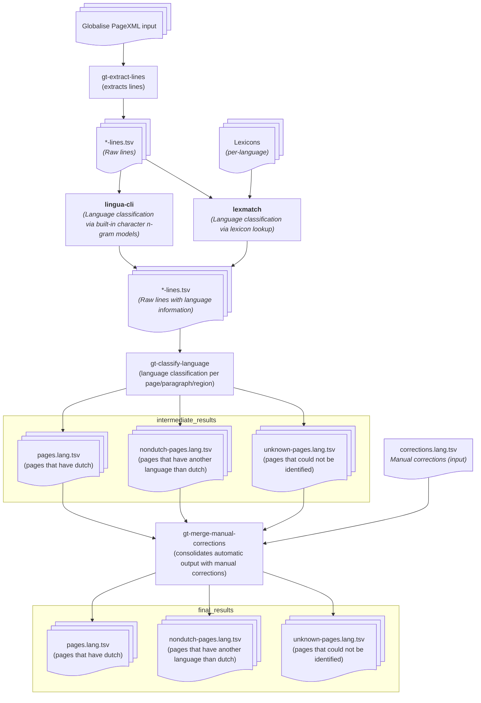

This is a pipeline for language detection on the Globalise HTR output.

The raw results are delivered in <https://github.com/globalise-huygens/language-identification-data> , where the methodology is also described in detail. An architecture schema is provided at the bottom of this readme.

## Usage

You will need a Linux/BSD/macOS system with `make`, `cargo`, `rustc` and a
recent enough `python3` (>= 3.12). On Ubuntu/Debian Linux this is accomplished with `apt
install make cargo python`.

First clone this git repository. Then from this directory, run the following to
check and install necessary dependencies. 

```
$ make setup
```

This will check necessary dependencies, create a Python virtual environment
with the globalise-tools, and compile and install
[lingua-cli](https://github.com/proycon/lingua-cli) and
[lexmatch](https://github.com/proycon/lexmatch) which are used for language detection.

Activate the Python virtual environment that was created in the above step: 

```
$ source env/bin/activate
```

Next, extract data from the globalise page XMLs as follows, pass the path where
your globalise page XMLs are (grouped in directories corresponding with
inventory numbers). This will create many `*-lines.tsv` files that will be the
input for the actual pipeline:

```
$ make fromxml 
```

You can pass the path where the PageXML files are extracted (as obtained from https://hdl.handle.net/10622/LVXSBW) by appending or prepending the following to the above command:

```
PAGEXML_PATH=/path/to/pagexml
```

It defaults to a `pagexml/` directory in the current working directory.

Then run the actual language detection pipeline as follows:

```
$ make all
```


**Note:** Processing may take a long time if done serially, it is therefore
strongly recommended to make use of multiple CPU cores by passing `-j 20`
(example for 20 cores) to `make` to speed up to process.

The main results will be in `pages.lang.tsv`, secondary results in
`nondutch-pages.lang.tsv` (everything that includes another language) and
`unknown-pages.lang.tsv` (everything that could not be identified).

## Docker

You can also run all of this in a docker container. First run `make docker` from the repository root directory (i.e. not this one!). Then copy and edit `docker.template.env` to set your paths. You can then run `make docker-run` from THIS directory, it will first run the `frompagexml` make target and then the `all` step. Alternatively, you can run `make docker-run-shell` to be dropped in an interactive shell so you can run these yourself.

## Architecture



* Arrow follow data flow direction
* Rectangles represent processes
* All ``gt-*`` processes refer to globalise-tools, as provided by this repository


